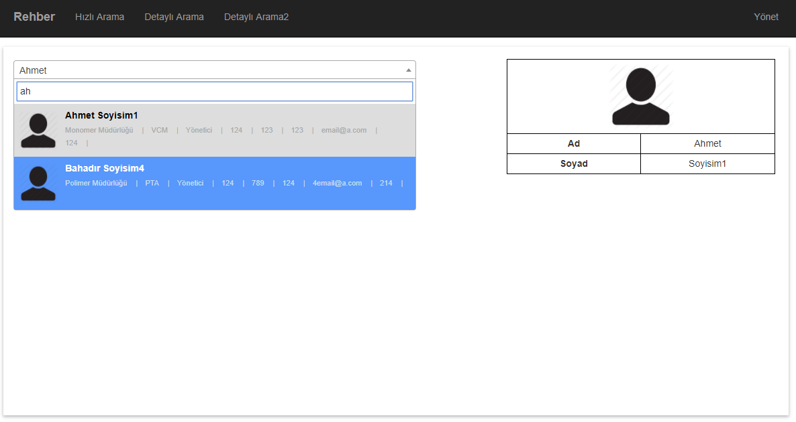
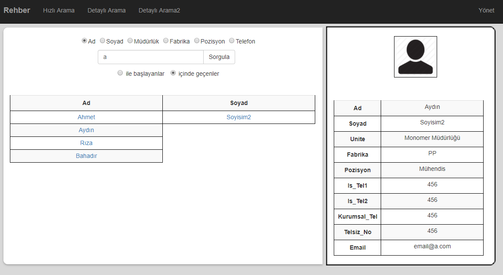

# Rehber Arama Sitesi

- Select2 jQuery kütüphanesi kullanılarak çeşitli arama yöntemleri geliştirilmiştir.
- Detaylı arama sayfası ile çeşitli tercihler sunulmuştur.

## Kurulum

- Database Model Entities çalışması için App_Data klasörü altında bulunan "script.sql" script'in çalıştırılıp local MS-SQL Server'a bağlanması gerekmektedir.

## Sitenin Bazı Sayfaları

